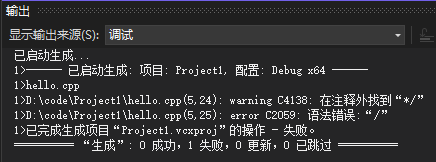

# C++ Primer课后习题

## 第一章 开始

### 练习1.1

查阅你使用的编译器文档，确定它所使用的文件命名约定。编译并运行第2页的main程序。

[为 Visual C++ 项目创建的文件类型](https://msdn.microsoft.com/zh-cn/library/3awe4781(v=vs.120).aspx)


### 练习1.2

改写程序，让它返回-1。返回值-1通常被当作程序错误的标识。重新编译并运行你的程序，观察你的系统如何处理main返回的错误标识。


### 练习1.3

编写程序，在标准输出上打印 Hello, World。

```c++
#include <iostream>
int main()
{
	std::cout << "Hello,World" << std::endl;
	return 0;
}
```

### 练习1.4

我们的程序使用加法运算符+来将两个数相加。编写程序使用乘法运算符*，来打印两个数的积。

```c++
#include <iostream>
int main()
{
	std::cout << "Enter two numbers:" << std::endl;
	int v1 = 0, v2 = 0;
	std::cin >> v1 >> v2;
	std::cout << "The product of " << v1 << " and " << v2 << " is " << v1 * v2;
	return 0;
}
```

### 练习1.5

我们将所有输出操作放在一条很长的语句中。重写程序，将每个运算对象的打印操作放在一条独立的语句中。

```c++
#include <iostream>
int main()
{
	std::cout << "Enter two numbers:";
	std::cout << std::endl;
	int v1 = 0, v2 = 0;
	std::cin >> v1;
	std::cin >> v2;
	std::cout << "The product of ";
	std::cout << v1;
	std::cout << " and ";
	std::cout << v2;
	std::cout << " is ";
	std::cout << v1 * v2;
	std::cout << std::endl;
	return 0;
}
```

### 练习1.6

解释下面程序片段是否合法。

```c++
std::cout << "The sum of " << v1;
		  << " and " << v2;
		  << " is " << v1 + v2 << std::endl;
```

如果程序是合法的，它输出是什么？如果程序不合法，原因何在？应该如何修正？

不合法，因为<<运算符缺少左侧运算对象，可以去掉前两行的最后的分号。

### 练习1.7

编译一个包含不正确的嵌套注释的程序，观察编译器返回的错误信息。

```c++
#include <iostream>
int main()
{
	/*这是一个注释
	/*这是一个嵌套*/*/
	return 0;
}
```



### 练习1.8

指出下列哪些输出语句是合法的(如果有的话)：

```c++
std::cout << "/*";
std::cout << "*/";
std::cout << /* "*/" */;
std::cout << /* "*/" /* "/*" */;
```

预测编译这些语句会产生什么样的结果，实际编译这些语句来验证你的答案(编写一个小程序，每次将上述一条语句作为其主体)，改正每个编译错误。

第三行错误，其余正确，改为`std::cout << /* "*/" */";`


### 练习 1.9

编写程序，使用while循环将50到100的整数相加。

```c++
#include <iostream>
int main()
{
	int sum = 0, val = 50;
	while (val <= 100)
	{
		sum += val;
		val++;
	}
	std::cout << sum << std::endl;
	return 0;
}
```

### 练习1.10

除了++运算符将运算对象的值增加1之外，还有一个递减运算符（--）实现将值减少1。编写程序，使用递减运算符在循环中按递减顺序打印出10到0之间的整数。

```c++
#include <iostream>
int main()
{
	int val = 10;
	while (val >= 0)
	{
		std::cout << val << std::endl;
		val--;
	}
	return 0;
}
```

### 练习1.11

编写程序，提示用户输入两个整数，打印出这两个整数所指定的范围内的所有整数。

```c++
#include <iostream>
int main()
{
	std::cout << "Enter two numbers:" << std::endl;
	int v1 = 0, v2 = 0;
	std::cin >> v1 >> v2;
	if (v1 > v2)
	{
		int t = v1;
		v1 = v2;
		v2 = t;
	}
	while (v1 <= v2)
	{
		std::cout << v1 << " ";
		v1++;
	}
	return 0;
}
```

### 练习1.12

下面的for循环完成了什么功能？sum的终值是多少？

```c++
int sum = 0;
for (int i = -100; i <= 100; ++i)
	sum += i;
```

从-100加到100，终值是0.

### 练习1.13

使用for循环重做1.4.1节中的所有练习（第11页）。

```c++
#include <iostream>
int main()
{
	int sum = 0;
	for (int val = 50; val <= 100; val++)
	{
		sum += val;
	}
	std::cout << sum << std::endl;
	return 0;
}
```

```c++
#include <iostream>
int main()
{
	for (int val = 10; val >= 0; val--)
	{
		std::cout << val << " ";
	}
	return 0;
}
```

```c++
#include <iostream>
int main()
{
	std::cout << "Enter two numbers:" << std::endl;
	int v1 = 0, v2 = 0;
	std::cin >> v1 >> v2;
	if (v1 > v2)
	{
		int t = v1;
		v1 = v2;
		v2 = t;
	}
	for (; v1 <= v2; v1++)
	{
		std::cout << v1 << " ";
	}
	return 0;
}
```

### 练习1.14

对比for循环和while循环，两种形式的优缺点各是什么？

1、在for循环中，循环控制变量的初始化和修改都放在语句头部分，形式较简洁，且特别适用于循环次数已知的情况。
2、在while循环中，循环控制变量的初始化一般放在while语句之前，循环控制变量的修改一般放在循环体中，形式上不如for语句简洁，但它比较适用于循环次数不易预知的情况（用某一条件控制循环）。
3、两种形式各有优点，但它们在功能上是等价的，可以相互转换。

### 练习1.15

编写程序，包含第14页“再探编译”中讨论的常见错误。熟悉编译器生成的错误信息。

常见的错误有语法错误、类型错误、声明错误，这些都是编译器可以检查出的错误。

### 练习1.16

编写程序，从cin读取一组数，输出其和。

```c++
#include <iostream>
int main()
{
	int v1 = 0,sum = 0;
	while (std::cin >> v1)
	{
		sum += v1;
	}
	std::cout << sum;
	return 0;
}

```

### 练习1.17

如果输入的所有值都是相等的，本节的程序会输出什么？如果没有重复值，输出又会是怎样的？


### 练习1.18

编译并运行本节的程序，给它输入全都相等的值。再次运行程序，输入没有重复的值。

如上题。

### 练习1.19

修改你为1.4.1节练习1.11（第11页）所编写的程序（打印一个范围内的数），使其能处理用户输入的第一个数比第二个数小的情况。

```c++
#include <iostream>
int main()
{
	std::cout << "Enter two numbers:" << std::endl;
	int v1 = 0, v2 = 0;
	std::cin >> v1 >> v2;
	if (v1 > v2)
	{
		int t = v1;
		v1 = v2;
		v2 = t;
	}
	for (; v1 <= v2; v1++)
	{
		std::cout << v1 << " ";
	}
	return 0;
}
```

### 练习1.20

在网站http://www.informit.com/title/032174113 上，第1章的代码目录包含了头文件 Sales_item.h。将它拷贝到你自己的工作目录中。用它编写一个程序，读取一组书籍销售记录，将每条记录打印到标准输出上。